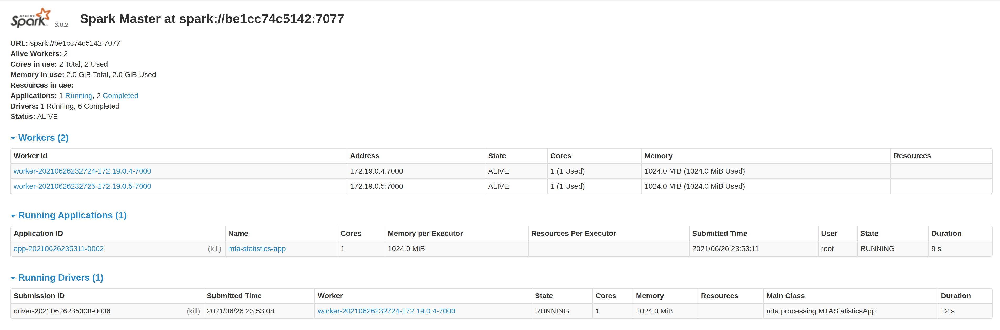

# A set of ML models for binary classification
## Spark Cluster with Docker & docker-compose

# General

A spark standalone cluster is hosted by three docker containers. The Docker compose will create the following containers:

container|Exposed ports
---|---
spark-master|9090 7077
spark-worker-1|9091
spark-worker-2|9092

# Installation

The following steps will make you run your spark cluster's containers.

## Pre requisites

* Docker installed

* Docker compose  installed

## Build the image


```sh
docker build -t cluster-apache-spark:3.3.0 .
```

## Run the docker-compose

The final step to create your test cluster will be to run the compose file:

```sh
docker-compose up -d
```

## Validate your cluster

Just validate your cluster accesing the spark UI on each worker & master URL.

### Spark Master

http://localhost:9090/


### Spark Worker 1

http://localhost:9091/


### Spark Worker 2

http://localhost:9092/


# Resource Allocation 

This cluster is shipped with three workers and one spark master, each of these has a particular set of resource allocation(basically RAM & cpu cores allocation).

* The default CPU cores allocation for each spark worker is 1 core.

* The default RAM for each spark-worker is 1024 MB.

* The default RAM allocation for spark executors is 256mb.

* The default RAM allocation for spark driver is 128mb

* If you wish to modify this allocations just edit the env/spark-worker.sh file.

# Binded Volumes

To make app running easier I've shipped two volume mounts described in the following chart:

Host Mount|Container Mount|Purposse
---|---|---
apps|/opt/spark-apps|Used to make available your app's jars on all workers & master
data|/opt/spark-data| Used to make available your app's data on all workers & master

**NOTE: the training data has been removed, please add your data file into apps/data**


# Run Sample applications


## Pyspark

This program loads Arrhythmia data to train a binary classification model, please preload the data into apps/data folder.

This program can also be used for other binary classification tasks. Just simply add your customerised data loading functions into prepare_data.py file. Then change the settings in the ml_job.py to fit your purpose of training.

To submit the app connect to one of the workers or the master and execute:

```sh
/opt/spark/bin/spark-submit --master spark://spark-master:7077 \
--py-files /opt/spark-apps/packages.zip \
--driver-memory 1G \
--executor-memory 1G \
--files /opt/spark-apps/ml_configs.json \
/opt/spark-apps/ml_job.py
```


You will notice on the spark-ui a driver program and executor program running(In scala we can use deploy-mode cluster)



# Model Configuration
Currently, this project supports 4 types of classification models (LogisticRegression, DecisionTreeClassifier, RandomForestClassifier,  and GBTClassifier). The number of models can simplied expanded by adding more settings in the apps/model_config.py.
You can also modify the hyperparameters as your needs.
**NOTE: all types of classifiers under the "pyspark.ml.classification" can be inserted.

For example 
```
classifictaion_models = {
    'LogisticRegression':
        {'maxIter':30, 
         'featuresCol':'selectedFeatures', 
         'labelCol':'label', 
         'regParam':0.1, 
         'tuning_params':{
             'maxIter':[10, 20, 30],
             'regParam': [0.1, 0.01]
         }}, }
```
